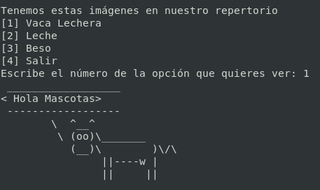

# Menú para elegir una imagen ascii art  :cow: :cow2: :dog:
## Ejecución  
```
$ g++ menuasciiArt.cpp
$ ./a.out
```
1. Si elijes la opción 1  

2. Si elijes la opción 2  

3. Si elijes la opción 3  

4. Si elijes la opción 4  

